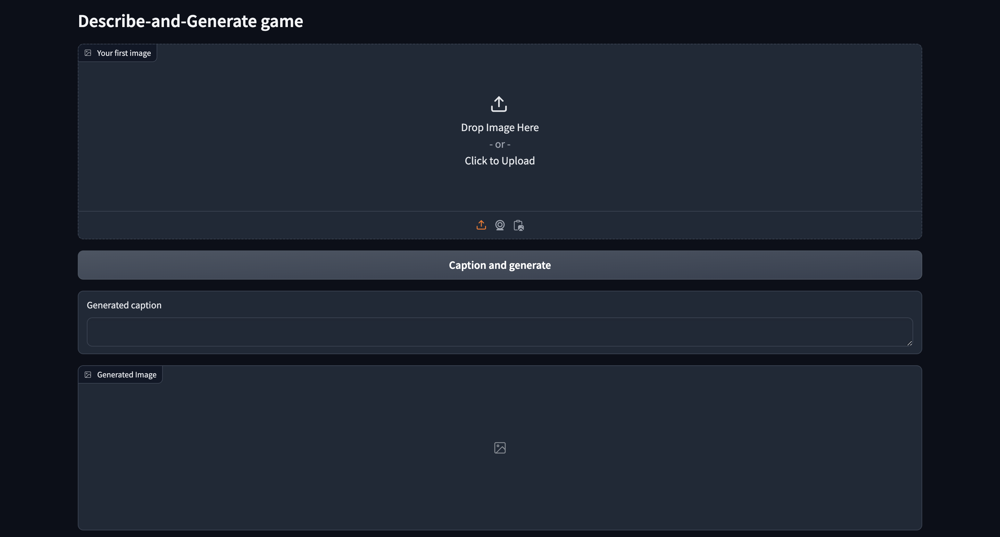
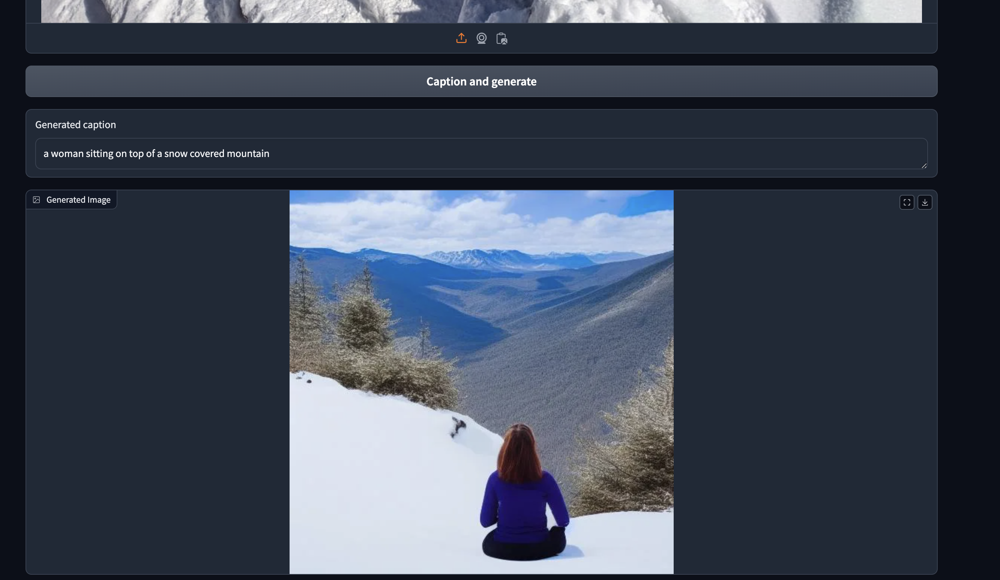

# Generative AI Game: Image Captioning and Generation

## Overview

This project is a generative AI-powered game app that combines image captioning and image generation functionalities. Built using Gradio for the user interface and Hugging Face API for AI-powered captioning and image generation, this game allows users to upload an image, generate captions, and create new images from captions in an engaging and interactive format.

## Features

- **Image Upload:** Users can upload an image to start the game.
- **Image Captioning:** Generates descriptive captions for uploaded images using the Hugging Face image-to-text API.
- **Image Generation:** Creates new images based on captions using the Hugging Face text-to-image API.
- **Combined Action:** Allows users to caption and generate an image in a single step for a streamlined experience.

## Setup

Prerequisites

- Python 3.7 or higher
- Hugging Face API key (for access to image-to-text and text-to-image models)
- Gradio library

Clone the repository
git clone <repository-url>

Set up the Hugging Face API key

- Create a .env file in the project root.
- Add your Hugging Face API key in the .env file
  -HF_API_KEY=your_huggingface_api_key

## Project Structure

- app.py: Main script to run the Gradio application.
- .env: Environment file for storing API keys securely.
- README.md: Project documentation.

## Execution results

<BlazoredVideo @ref="video" EventFired="OnEvent"
               VideoEventOptions="options"
               autoplay="autoplay" 
               loop="loop" 
               muted="muted">
    <source src="assets/video.mp4" type="video/mp4" />
</BlazoredVideo>

## Screenshot of execution results

# To learn more

[Google Slide](./assets/StoryFromImage.pptx)
